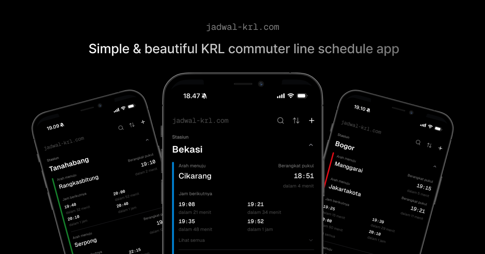

<a href="https://www.comuline.com">
  
  <h1 align="center">Comuline</h1>
</a>

<p align="center">
  Simple & beautiful KRL commuter line schedule app
</p>

<p align="center">
  <a href="https://twitter.com/abielzulio">
    
  </a>
  <a href="https://github.com/abielzulio/jadwal-krl">
    
  </a>
</p>

<p align="center">
  <a href="#introduction"><strong>Introduction</strong></a> ·
  <a href="#development"><strong>Development</strong></a> ·
  <a href="#contributing"><strong>Contributing</strong></a> ·
  <a href="#author"><strong>Author</strong></a> ·
  <a href="#license"><strong>License</strong></a>
</p>
<br/>

## Introduction

[Comuline](https://www.comuline.com) is a dead-ass simple & beautiful Indonesian public train commuter line app, featuring search and save station locally and get real-time schedule from our [own public API replication](https://github.com/comuline/api). [Comuline](https://www.comuline.com) built with [Vite](https://vite.dev/) and deployed to [Cloudflare Pages](https://pages.cloudflare.com/).

[Comuline](https://www.comuline.com) made as a public act of our belief that public transportation data should be publicly accessible.
To any stakeholder that responsible with the data that we're consumed, if you read this, [I'm](https://www.linkedin.com/in/abielzulio/) willing to join your team to build the best public transportation data infrastructure ever for our own good sake.

## Development

To get a local copy up and running, please follow these simple steps.

### Setup

1. Clone the repo

   ```sh
   git clone https://github.com/comuline/web.git
   ```

2. Go to the project folder

   ```sh
   cd web
   ```

3. Install packages

   ```sh
   bun i
   ```

4. Copy the `.env.example` to `.env`

   ```sh
   cp .env.example .env
   ```

5. Generate typescript SDK from the API using [OpenAPI TS](https://openapi-ts.dev/)

   ```sh
   bun run api:gen
   ```

6. Run the app locally

   ```sh
   bun run dev
   ```

## Contributing

Here's how you can contribute:

- [Open an issue](https://github.com/comuline/web/issues) if you believe you've encountered a bug.
- Make a [pull request](https://github.com/comuline/web/pull) to add new features/make quality-of-life improvements/fix bugs.

## License

Distributed under the [AGPLv3 License](https://github.com/comuline/web/blob/main/LICENSE). See `LICENSE` for more information.
